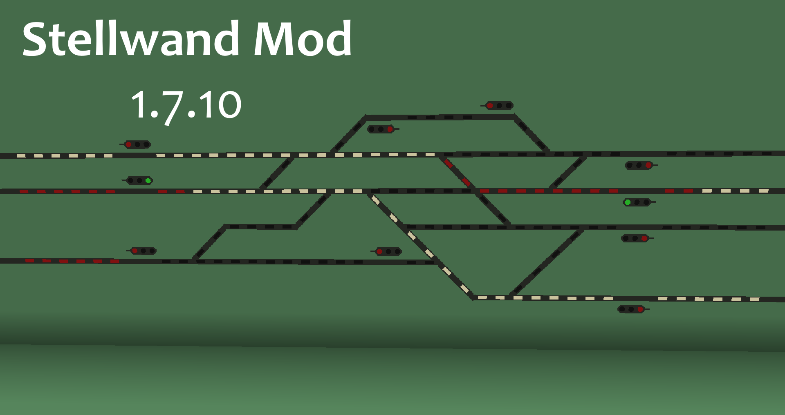
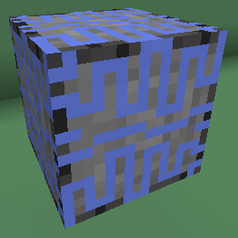
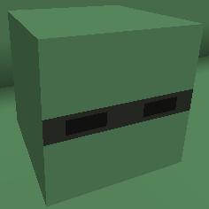

# Stellwand (MC 1.7.10)
Author: [Danielxs01 aka. SeltixSub](https://github.com/Danielxs01) 
Content: [Citarofahrer](https://github.com/Citarofahrer) 
For: <https://landofrails.net> 

Adds Signalblocks and Senders 
There are multiple signals which have diffrent priorities

## INFORMATION

Massive update planned.
The frequency option will be removed in the next release.
Connections can get lost.

## Usage

 
Define a frequency and set the wanted signal. 
To activate the sender you have to give it a redstone signal.

 
 
 

 
Set the frequency and you are good to go.
